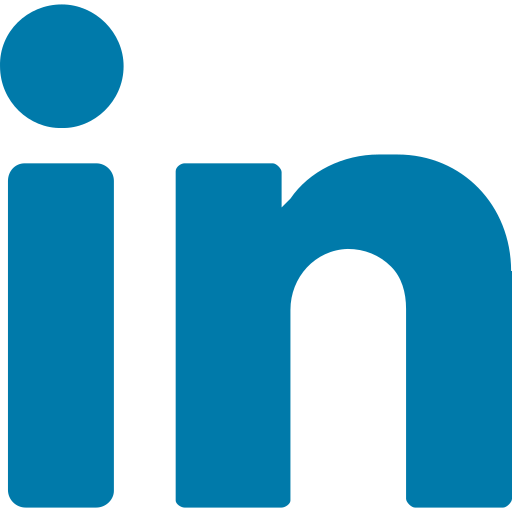

# Hi there, I'm Saransh - aka CryptoSingh 👋

<div align="center">

</div>

## I'm a Student and a Gamer!

- 🔭 I’m currently working on my problem solving skills and building hobby projects.
- 🌱 I’m currently learning Go and Machine Learning.
- ⚡ Fun fact: I love to watch sci-fi movies and playing FPS/RPG games.

<a href="https://www.saransh.pro/" target="_blank"></a>&nbsp;&nbsp;
<a href="https://discord.gg/6efHuzv" target="_blank"></a>&nbsp;&nbsp;
<a href="https://cryptosingh1337.medium.com/" target="_blank"></a>&nbsp;&nbsp;
<a href="https://youtube.com/cryptosingh" target="_blank"></a>&nbsp;&nbsp;
<a href="https://linkedin.com/in/saransh-kumar-2k19/" target="_blank"></a>&nbsp;&nbsp;
<a href="https://leetcode.com/cryptosingh/" target="_blank"></a>&nbsp;&nbsp;
<a href="https://codechef.com/users/cryptosingh" target="_blank"></a>
<br>
<br>
<a href="https://github.com/CryptoSingh1337/CryptoSingh1337/raw/master/resume/SaranshKumar-Resume.pdf" download></a>

##

### Technologies and Tools:

<div align="center">
 <code></code>
 <code></code>
 <code></code>
 <code></code>
 <code></code>
 <code></code>
 <code></code>
 <code></code>
 <code></code>
 <code></code>
 <code></code>
 <code></code>
</div>

<br>

[](https://wakatime.com/@b9df6102-292d-4e04-8c49-0347a58ded19)
<!--START_SECTION:waka-->


**🐱 My GitHub Data** 

> 📦 246.1 kB Used in GitHub's Storage 
 > 
> 🏆 1,462 Contributions in the Year 2026
 > 
> 💼 Opted to Hire
 > 
> 📜 60 Public Repositories 
 > 
> 🔑 23 Private Repositories 
 > 
**I'm a Night 🦉** 

```text
🌞 Morning                1141 commits        █░░░░░░░░░░░░░░░░░░░░░░░░   02.47 % 
🌆 Daytime                12030 commits       ███████░░░░░░░░░░░░░░░░░░   26.02 % 
🌃 Evening                18575 commits       ██████████░░░░░░░░░░░░░░░   40.18 % 
🌙 Night                  14487 commits       ████████░░░░░░░░░░░░░░░░░   31.33 % 
```


📊 **This Week I Spent My Time On** 

```text
🕑︎ Time Zone: Asia/Kolkata

💬 Programming Languages: 
Java                     11 hrs 7 mins       ████████░░░░░░░░░░░░░░░░░   31.41 % 
Markdown                 9 hrs 16 mins       ███████░░░░░░░░░░░░░░░░░░   26.19 % 
Python                   4 hrs 3 mins        ███░░░░░░░░░░░░░░░░░░░░░░   11.47 % 
TypeScript               3 hrs 37 mins       ███░░░░░░░░░░░░░░░░░░░░░░   10.22 % 
Vue                      3 hrs 18 mins       ██░░░░░░░░░░░░░░░░░░░░░░░   09.33 % 

🔥 Editors: 
IntelliJ IDEA            19 hrs 18 mins      ██████████████░░░░░░░░░░░   54.49 % 
Claude Code              15 hrs 55 mins      ███████████░░░░░░░░░░░░░░   44.91 % 
Sublime Text             12 mins             ░░░░░░░░░░░░░░░░░░░░░░░░░   00.60 % 

💻 Operating System: 
Windows                  20 hrs 49 mins      ███████████████░░░░░░░░░░   58.76 % 
Mac                      14 hrs 36 mins      ██████████░░░░░░░░░░░░░░░   41.24 % 
```

🤖 **AI Coding This Week** 

```text
⏱ AI Coding Time: 22 hrs 33 mins (63.66%)

✍️ 18,544 lines written by AI, 2,819 lines written by hand (86.8% AI-written)

🔤 7,246,895 Input Tokens, 1,652,849 Output Tokens

💵 $352.44 Estimated AI Cost This Week

🧠 39 AI Sessions, 260 AI Prompts

Opus                     15,634 lines        ███████████████████░░░░░░   74.67 % 
Fable                    5,304 lines         ██████░░░░░░░░░░░░░░░░░░░   25.33 % 
Sonnet                   0 lines             ░░░░░░░░░░░░░░░░░░░░░░░░░   00.00 % 

🔎 AI Coding Insights:
🤖 AI-Driven — 86.8% of written lines came from AI
📚 Verbose Prompter — average 2,744 characters per prompt
🔁 Iterative Prompter — average 7 prompts per session
🚀 High AI Trust — 29.04% of changed lines were hand-edited
```


 Last Updated on 22/08/2026 01:51:49 UTC
<!--END_SECTION:waka-->
