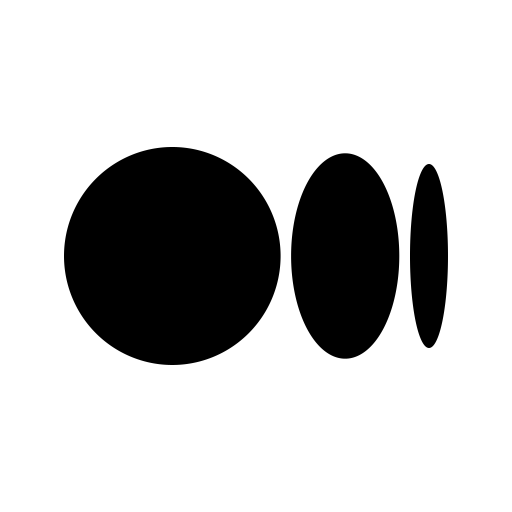

# Hi there, I'm Saransh - aka CryptoSingh 👋

<div align="center">

</div>

## I'm a Student and a Gamer!

- 🔭 I’m currently working on my problem solving skills and building hobby projects.
- 🌱 I’m currently learning Go and Machine Learning.
- ⚡ Fun fact: I love to watch sci-fi movies and playing FPS/RPG games.

<a href="https://www.saransh.pro/" target="_blank"></a>&nbsp;&nbsp;
<a href="https://discord.gg/6efHuzv" target="_blank"></a>&nbsp;&nbsp;
<a href="https://cryptosingh1337.medium.com/" target="_blank"></a>&nbsp;&nbsp;
<a href="https://youtube.com/cryptosingh" target="_blank"></a>&nbsp;&nbsp;
<a href="https://linkedin.com/in/saransh-kumar-2k19/" target="_blank"></a>&nbsp;&nbsp;
<a href="https://leetcode.com/cryptosingh/" target="_blank"></a>&nbsp;&nbsp;
<a href="https://codechef.com/users/cryptosingh" target="_blank"></a>
<br>
<br>
<a href="https://github.com/CryptoSingh1337/CryptoSingh1337/raw/master/resume/SaranshKumar-Resume.pdf" download></a>

##

### Technologies and Tools:

<div align="center">
 <code></code>
 <code></code>
 <code></code>
 <code></code>
 <code></code>
 <code></code>
 <code></code>
 <code></code>
 <code></code>
 <code></code>
 <code></code>
 <code></code>
 <code></code>
 <code></code>
 <code></code>
</div>

### ⚡ Recent GitHub Activity

<!--RECENT_ACTIVITY:start-->
1. ⬆️ Pushed 1 commit(s) to [CryptoSingh1337/cryptosingh1337.github.io](https://github.com/CryptoSingh1337/cryptosingh1337.github.io)<br>
2. ⬆️ Pushed 1 commit(s) to [CryptoSingh1337/CryptoSingh1337](https://github.com/CryptoSingh1337/CryptoSingh1337)<br>
3. ⬆️ Pushed 1 commit(s) to [CryptoSingh1337/serpent-clash](https://github.com/CryptoSingh1337/serpent-clash)<br>
4. ⬆️ Pushed 1 commit(s) to [CryptoSingh1337/serpent-clash](https://github.com/CryptoSingh1337/serpent-clash)<br>
5. ⬆️ Pushed 1 commit(s) to [CryptoSingh1337/serpent-clash](https://github.com/CryptoSingh1337/serpent-clash)<br>
<!--RECENT_ACTIVITY:end-->

[](https://wakatime.com/@b9df6102-292d-4e04-8c49-0347a58ded19)
<!--START_SECTION:waka-->
**🐱 My GitHub Data** 

> 📦 228.2 kB Used in GitHub's Storage 
 > 
> 🏆 519 Contributions in the Year 2025
 > 
> 💼 Opted to Hire
 > 
> 📜 55 Public Repositories 
 > 
> 🔑 16 Private Repositories 
 > 
**I'm a Night 🦉** 

```text
🌞 Morning                391 commits         █░░░░░░░░░░░░░░░░░░░░░░░░   03.78 % 
🌆 Daytime                2430 commits        ██████░░░░░░░░░░░░░░░░░░░   23.47 % 
🌃 Evening                5418 commits        █████████████░░░░░░░░░░░░   52.33 % 
🌙 Night                  2115 commits        █████░░░░░░░░░░░░░░░░░░░░   20.43 % 
```


📊 **This Week I Spent My Time On** 

```text
🕑︎ Time Zone: Asia/Kolkata

💬 Programming Languages: 
Java                     21 hrs 12 mins      ██████████████████░░░░░░░   70.33 % 
TypeScript               3 hrs 1 min         ███░░░░░░░░░░░░░░░░░░░░░░   10.04 % 
Go                       1 hr 46 mins        █░░░░░░░░░░░░░░░░░░░░░░░░   05.90 % 
YAML                     1 hr 45 mins        █░░░░░░░░░░░░░░░░░░░░░░░░   05.85 % 
Markdown                 52 mins             █░░░░░░░░░░░░░░░░░░░░░░░░   02.90 % 

🔥 Editors: 
IntelliJ IDEA            29 hrs 42 mins      █████████████████████████   98.53 % 
Sublime Text             20 mins             ░░░░░░░░░░░░░░░░░░░░░░░░░   01.14 % 
VS Code                  6 mins              ░░░░░░░░░░░░░░░░░░░░░░░░░   00.33 % 

💻 Operating System: 
Mac                      23 hrs 48 mins      ████████████████████░░░░░   78.94 % 
Windows                  6 hrs 20 mins       █████░░░░░░░░░░░░░░░░░░░░   21.06 % 
```


 Last Updated on 23/07/2025 02:27:20 UTC
<!--END_SECTION:waka-->
